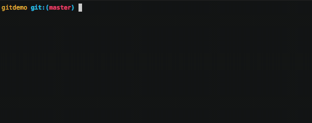
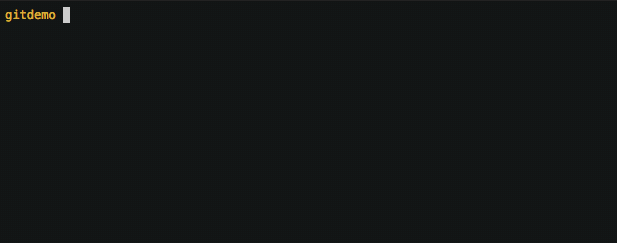
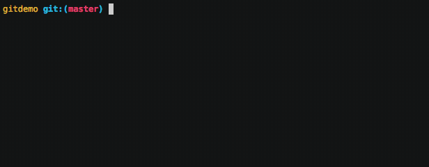
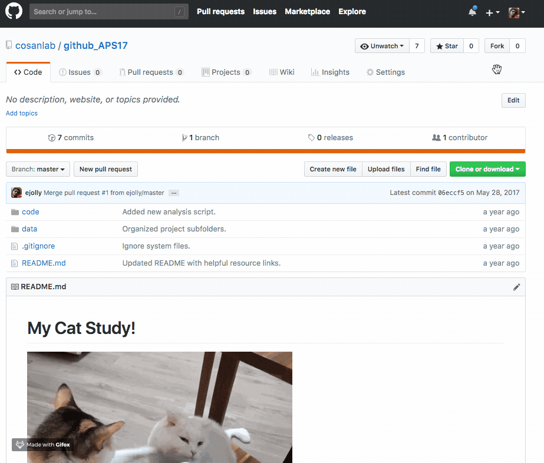
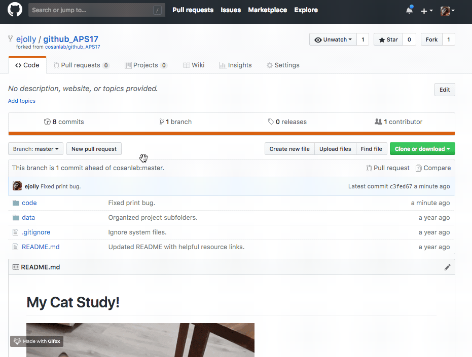

# Introduction to Git and Github

This is a brief introduction to git and github. Conceptual overview slides are available as well as a quick reference guide and a more comprehensive command list.  

Below are examples of the more common commands you're likely to used regularly. These are also rendered as a brief blog post [here](https://eshinjolly.com/2019/01/04/git_github/).    

## Most common commands  

`git status`  
see what files are ready to be made into a "snapshot" (committed) and which ones are not being kept track of  
  

`git init`  
create a new git repository for the first time (will not add any files)  
  

`git add`  
add file(s) to the list of files that should be made into a "snapshot" (committed)
  

`git commit`  
take a "snapshot" of all currently tracked project files. Files need to be "prepped" (staged) for commit using `git add` beforehand.    
  

`git log`  
see the full historical timeline of the project  
  

`git push`  
send latest local changes to a remote location (e.g. github)  
  

`git pull`  
get the latest changes from a remote location (e.g. github)  
  

`git clone`  
duplicate a remote repository (e.g. github) on your local computer  

`git branch`  
create a new independent "timeline" for the project  
  

`git revert`  
undo changes by reversing any specific "snapshot" (commit)  
  

`forking`  
copy a remote repository on github, to your own remote account on github  
  

`pull request`  
notify a remote repository owner you would like them to review+incorporate your additions  

